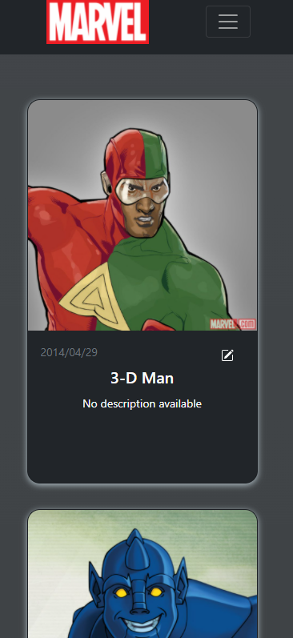
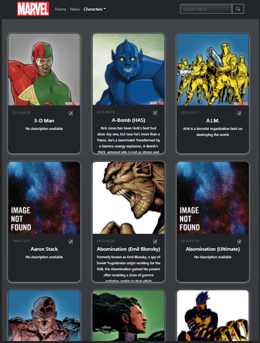
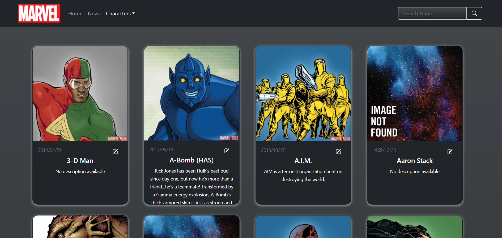

# Marvel

## Índice

* [1. Descripción general](#1-descripción-general)
* [2. Interfaz](#2-interfaz)
* [3. Tecnologías](#3-tecnologías)
* [4. Link](#4-link)

***
## 1. Descripción general

Desarrollo de Interfaz web responsive de los personajes de Marvel. El contenido de la página destaca a los personajes de Marvel en donde se puede visualizar una imagen que lo identifica y caracteriza y también se brinda información de los mismos, como el nombre, fecha y una breve descripción.

En cuanto al diseño, la página web posee una paleta de colores que caracteriza a Marvel en donde predomina el Negro y la escala de grises, el cual destaca y resalta los elementos de interés. También destaca el color rojo icónico de Marvel para imponer algunos detalles y elementos. Y por último el blanco en el texto que al hacer contraste con los colores oscuros destaca para facilitar la lectura.

El usuario podrá buscar específicamente a su personaje favorito o de interés por su nombre a través del buscador.

Al explorar la página y el listado de los personajes posee infinite scroll para que el usuario pueda contemplar los personajes sin límite, el cual si desea volver al inicio cuanta con un botón Scroll To Top.

También en la barra de navegación cuenta con un menú en donde podrá acceder a  las páginas oficiales de Marvel de distinto índole.

## 2. Interfaz
## Mobile

## Tablet

## Desktop

## 3. Tecnologías

* React.js.
* JavaScript ES6.
* Bootstrap 5.
* Node.js

## 4. Link
